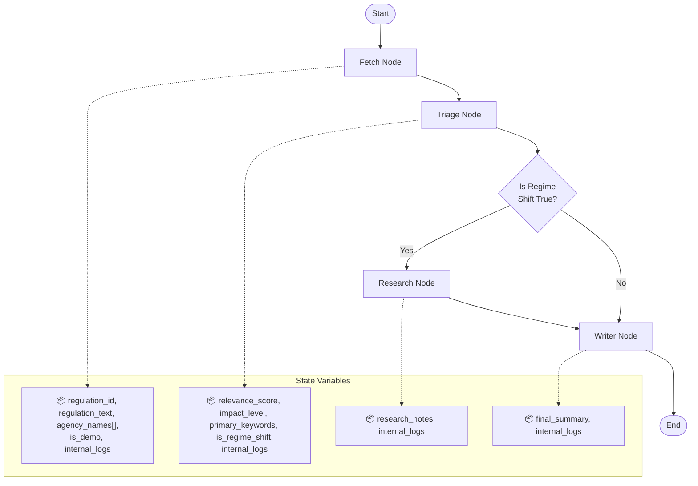

# 🛡️ Regulatory Radar (Agentic AI Edition)

An autonomous AI agent built with LangGraph that revolutionizes regulatory compliance monitoring for wealth management firms. It doesn't just read the news—it analyzes the regulatory regime, detects coordinated agency enforcement patterns ("Regime Shifts"), and autonomously conducts deep-dive research to produce executive-ready risk briefs.

## 🚨 The Problem

Compliance officers are drowning in a "Sea of Sameness" — thousands of federal filings where the critical 1% of high-impact shifts are buried under noise.

## 💡 The Solution

Regulatory Radar uses state-driven orchestration to triage federal filings, combining quantitative velocity triggers with qualitative LLM reasoning. When regime shifts are detected, it autonomously conducts targeted research using Tavily Search to synthesize law firm alerts and SEC enforcement history into cohesive "Heat Map" briefs.

## 🏗️ Core Technical Moats

- **State-Driven Orchestration**: LangGraph manages agent memory and conditional branching
- **Dual-Factor Triage**: Quantitative triggers + LLM reasoning (Llama-3.3-70b via Groq)
- **Autonomous Research**: Integrated web search for enforcement context
- **High-Performance Stack**: Python backend, Supabase (PostgreSQL), Streamlit Cloud

## ✨ Key Features

### Automated Regulation Ingestion
- Fetches detailed regulation information from Supabase database
- Processes regulation titles, summaries, and agency associations

### AI-Powered Triage & Scoring
- Relevance scoring (1-10 scale) for wealth management impact
- Impact classification (Low/Medium/High/Critical)
- Keyword extraction and regime shift detection
- Multi-agency coordination analysis
- Agency velocity monitoring

### Conditional Deep Research
- Triggered only when regime shifts detected
- Targeted web searches for enforcement context
- Integration with Tavily Search API
- Structured research notes with sources

### Executive Brief Generation
- "Regulatory Heat Map" reports
- Risk ratings (Red/Amber/Green)
- Executive summaries and action items
- Written from Lead Regulatory Consultant perspective

## 🏛️ Architecture

The system is built on LangGraph for state management and conditional execution:

- **Ingestion Layer**: Fetches regulations from Supabase
- **Triage Layer**: AI-powered relevance assessment
- **Research Layer**: Conditional deep-dive analysis
- **Briefing Layer**: Executive report generation
- **Dashboard Layer**: Streamlit interface for monitoring

